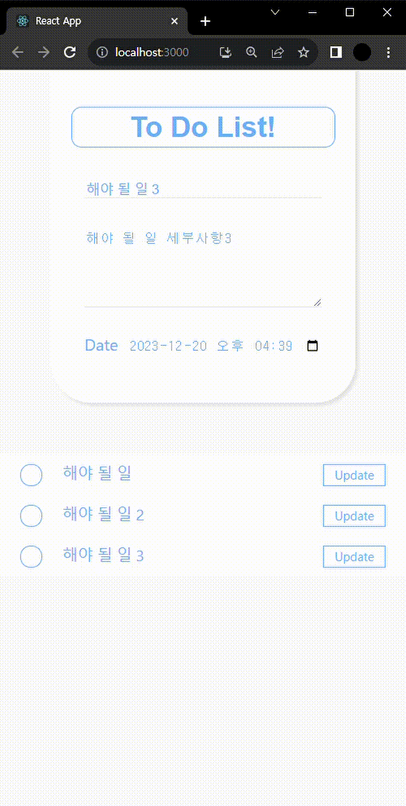

# ToDo리스트

## 프로젝트 개요
> 개발 스택 : React  
> 개발 기간 : 2022.12.26 ~ 2022.12.29  
> 프로젝트 목표 :  리액트에 대한 적응 및 학습 
> 주요기능 : 해야 할 일을 기록 및 수정, 삭제가 가능한 리액트 앱  

### 메인 화면
  

### 기능 설명
#### 1.등록
 
화면 중앙에 있는 폼에 해야할 일, 세부사항, 날짜를 선택한 후 ToDo를 누르면 일정이 등록됩니다.  

#### 2.세부사항보기
 
일정을 더블 클릭하면 세부사항과 날짜를 볼 수 있습니다. 날짜는 클릭 시 현재 시를 기준으로 남은 시간을 확인할 수 있습니다.  

#### 3.수정하기
 
일정 상단 우측에 update 버튼을 누르면 수정 폼이 나옵니다. 내용 수정 후 입력과 같이 ToDo버튼을 누르면 수정됩니다.  

#### 4.삭제하기
 
일정 좌측 ○버튼을 누르면 일정이 삭제 됩니다.  
